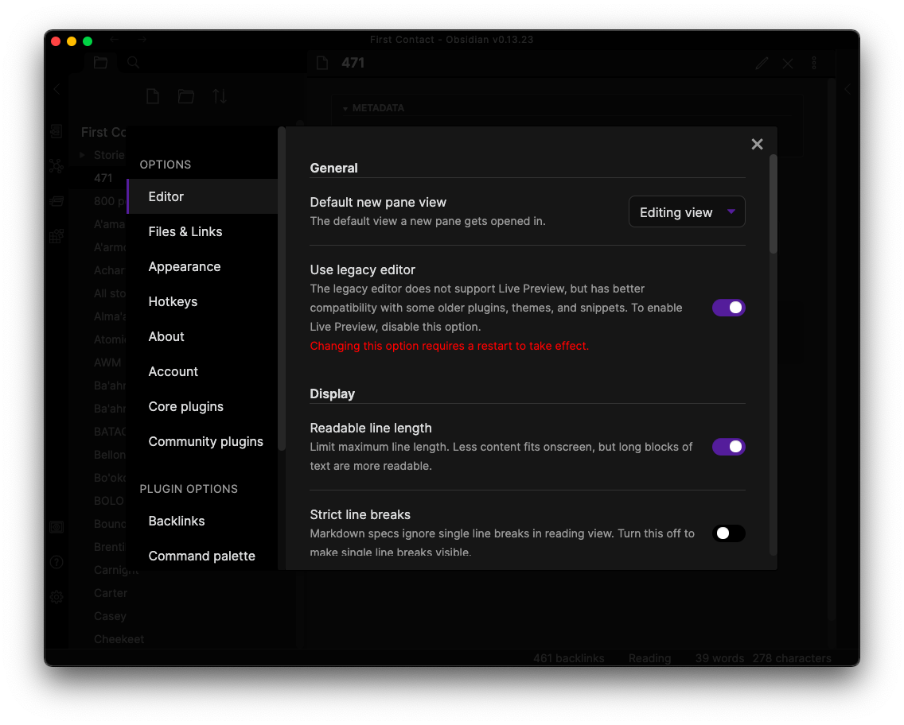
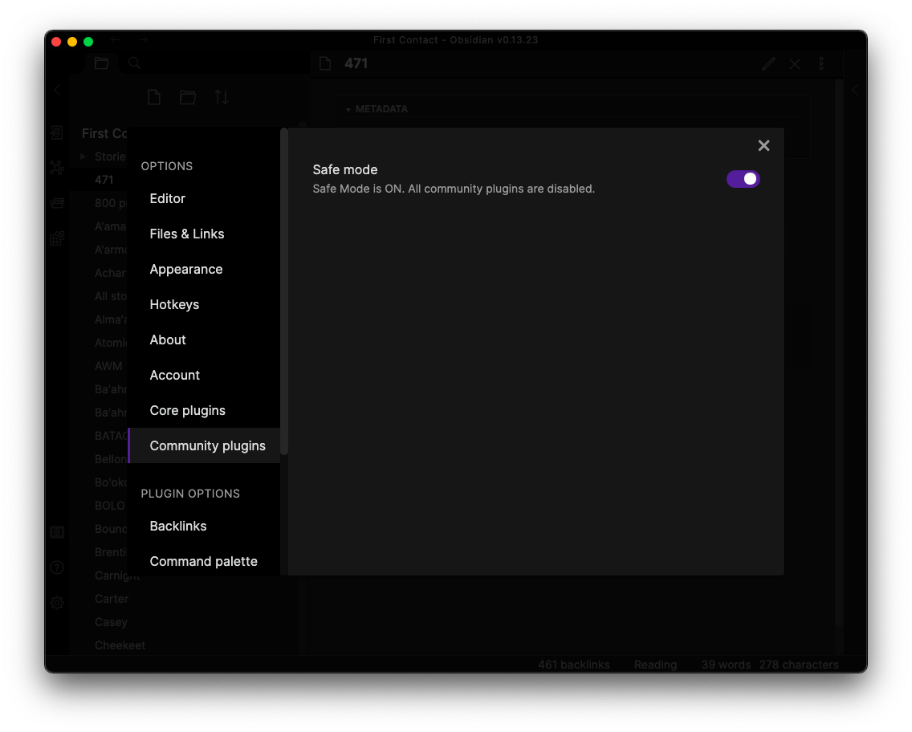

# Ralts - a 'First Contact' story downloader/processor

> This page is a 'trial balloon' set up for people on the Discord server

## Contents

- [What's this about?](#whats-this-about)
- [What does it do?](#what-does-it-do)
- [What does the output look like?](#what-does-the-output-look-like)
- [Installing](#installing)
- [Typical usage](#typical-usage)
    - [Using 'mattrans' - getting files from Reddit](#using-mattrans---getting-files-from-reddit)
    - [Using 'suds' to process files into stories](#using-suds-to-process-files-into-stories)
    - [Using 'cloud' to copy files to your cloud service](#using-cloud-to-copy-files-to-your-cloud-service)
    - [Using novaspark.py to create story stubs](#using-novasparkpy-to-create-story-stubs)
- [Setting up Obsidian](#setting-up-obsidian-to-use-dataview-and-admonitions)

## What's this about?

This tool downloads and processes the _First Contact_ stories from `r/HFY`.

If you're not familiar with [HFY](https://old.reddit.com/r/HFY/), you're missing out. I'll let r/HFY introduce itself:

> We're a writing focused subreddit welcoming all media exhibiting the awesome potential of humanity, known as HFY or "Humanity, Fuck Yeah!"
> We welcome sci-fi, fantasy, and all other stories with a focus on humans being awesome!

The 'First Contact' HFY stories by `u/Ralts_Bloodthorne`, started on 25th Feb 2020 with a single quirky story about an alien who likes ice cream through and has grown to a huge corpus of 721 stories and 2,034,125 words (at the time of writing). Ralts' output has been phenomenal, sometimes posting 4 stories a day, and in the process occasionally triggering some Reddit spam filters!

There's at least 100 characters and over 25 races or groups in the _First Contact_ universe and it can be difficult keeping up. That's one reason for making this tool. Another one is that it's crystal clear from the comments that `ralts`'s work has helped many people get through some extraordinarily difficult times, and I don't think it's an exaggeration to say that the stories and community built up around them have saved some lives. Hopefully this tool helps that community wander through the _First Contact_ universe more easily.

The tool works in tandem with the increasingly popular [Obsidian](https://obsidian.md) knowledge base, which is sometimes touted as a 'second brain'. Obsidian hosts all files locally, is free to use and is extensible through a vibrant third-party plugins and theming community which has made some exceptional plugins, including an SQL-like database engine called `dataview` that `ralts` uses extensively.

## What does it do?

The tool downloads stories written by `u/Ralts_Bloodthorne` and processes them into [Markdown](https://en.wikipedia.org/wiki/Markdown) files which have been marked up to allow for easy linking of stories, characters, races and other items and events of interest. An example might help, this block of text:

> Herod watched as Victor stood perfectly still for a long moment, his eyes closed. Herod could see dozens of VR versions of the human moving at high speed through the VR spaces of  the Black Box and knew that the thousands of clones of Victor/Dhruv were working hard even as Legion stood stock still in the middle of the room with his eyes closed.

is converted into this:

>[[Herod]] watched as [[Legion|Victor]] stood perfectly still for a long moment, his eyes closed. [[Herod]] could see dozens of VR versions of the human moving at high speed through the VR spaces of  the Black Box and knew that the thousands of clones of [[Legion|Victor]]/[[Legion|Dhruv]] were working hard even as [[Legion]] stood stock still in the middle of the room with his eyes closed.

The `[[Herod]]` code is the Obsidian method of linking to a page called 'Herod' and the `[[Legion|Victor]]` code means that the word 'Victor' is shown as the link text, whilst the link is going to the page called 'Legion'. You might ask "who's this guy Legion and why is he known by so many names?". Well, that would be telling...

This is what it eventally looks like in Obsidian, the underlined text goes to pages about the characters, the 'Herod' link goes to one page, and the 'Victor', 'Dhruv' and 'Legion' links all go the same page, 'Legion':


Talking of screenshots...

## What does the output look like?

### Story listing

This page shows all the stories that have been processed. It's based on the `dataview` plugin of Obsidian, which has some SQL-like properties which can use metadata from each story, such as the story 'Score', 'Wordcount' and the date the story was 'Published' to create dynamic lists as shown below.


### Reading a single story
The character 'Speaks' is linked, showing that there's more information available about them, such as all the stories they appear in. You can easily navigate between the previous and next story, and as you can see from the text, there's a *lot* of action in _First Contact_ stories.


### Detailed information about a story
The 'Information about this story....' block links to the main characters in this particular story, along with races present, and the races of those characters.


There's also a lot of metadata in a story, and part of that is shown below. It's particularly useful when used in conjunction with Obsidian and the `dataview` plugin in particular.


### Character detail
We clicked on 'Daxin' from the last screen. Here's some background information on him, and what stories he's either in, or mentioned in. For Daxin, that's a lot.


### Themes, themes, themes...
[Obsidian](https://obsidian.md) has a huge theme collection, the screenshots above are the 'Dracula' theme, this is the default Obsidian light theme.

It's also extensively configurable, so you're bound to find something you like. If you find one that works better for _First Contact_, please share it!


If this sounds like something you'd be interested in, read on...

## Installing

As they used to say on the box, there's _some assembly required_.

You'll need:

- a `python3` installation set up
- some familiarity with the command line (not much!)
- a working knowledge of [Obsidian](https://obsidian.md)
- possibly a `git` installation if you choose to clone this repository

The code is written in `python3`, and you'll need to install some additional libraries to make it work.

You can get the code using either `git` or a downloadable release. If you're comfortable with `git` then clone the repository, otherwise download the `.zip` file and expand it into a folder.

Whether you clone the repositry, or download a release, you'll end up with this set of files.

```
README.md
assets
ralts.py
datastructs.py
novaspark.py
```

The main program is `ralts.py`, and you'll interact with this most of the time. `datastructs.py` holds definitions of who is a main character, their aliases if they have any, what race they are a part of, planets and other objects of interest. `novaspark.py` is optional, but it's very helpful to create (and delete) stub files for the over 100 characters ralts has created, as well as races and objects of interest. It's called `novaspark.py` to warn you it has some power...


```
% python3 pip install -r requirements.txt

# or you can install the modules separately
% python3 pip install pathlib docopt PyYAML rich bdfr
```

The `bdfr` module is a large multi-purpose Reddit post downloader, and loads in quite a few other modules.

Here's the output of the `./ralts.py -h` command:

```
-> python3 ralts.py -h
Process Ralts_Bloodthorne stories (primarily the r/HFY posts)

Builds an Obsidian (https://obsidian.md) 'vault' which makes it much easier to
wander around the marvellous "First Contact" multiverse created by
https://www.reddit.com/user/Ralts_Bloodthorne/

Characters such as 'Daxin' are expanded out to [[Daxin]] so that Obsidian can
create a web of stories and interactions.
If a character is referred to by an alias, eg 'Luke', this is also expanded so
that the alias is shown, but the link refers to the canonical name, eg [[Legion|Luke]].

This expansion is done for races and the members of those races too, so that if
'Vuxten' appears in a story he's made linkable, as [[Vuxten]], flagged as a main
character and then it's noted that a [[Telkan]] is in the story.

You can then find all the stories where 'Vuxten' appears or where 'Terrans'
or 'Atrekna' are mentioned - that's all done within Obsidian, using a
plugin called 'dataview'.

It's also done for key phrases, such as 'LARP', 'Precursor' and
'Wrathful Mercury'.

The characters, races etc. are all extensible in the 'datastructs.py' file.

Usage:
    ralts.py suds [--all | --storycount=<ns> | --search=str] [-d] [--config=file]
    ralts.py cloud [-d] [--config=file]
    ralts.py mattrans [--all | --storycount=<ns>] [-d] [--config=file]
    ralts.py blueberries [-d] [--config=file]
    ralts.py (-h | --help)
    ralts.py --version

Commands:
    suds            Process stories and add Obsidian features ([[ ]] etc)
    cloud           Synchronise local Obsidian files with your cloud provider folder
    mattrans        Download posts by u/Ralts_Bloodthorne from Reddit. Not just from HFY!
    blueberries     Gets the last <storycount> stories, processes them and copies them to your cloud folder

Options:
    -all                Process/Download all stories [default: False]
    --storycount=<ns>   Number of stories to process/download
    --search=str        Only process stories whose title matches str (case sensitive)
    --config=file       Load this configuration file [default: config/config.yml]
    -h --help           Show this screen
    -d --debug          Show some debug information [default: False]
    --version           Show version [default: __version__]
```

If you've read the _First Contact_ stories you'll understand why I've chosen `suds`, `mattrans` and `blueberries` for commands, if you haven't then it's something else to look forward to.

## Typical Usage

An initial run might look something like:

### Using 'mattrans' - getting files from Reddit

```
# download the posts from Reddit

% python3 ralts.py mattrans --all
This is the first time running ralts.py.
Setting up a default configuration in config/config.yml. Change parameters to your
liking and re-run.
Configuration file config/config.yml newly written. Exiting...

# now the config file is created, have a look at it
% cat config/config.yml
ralts:
  is_pthoktest: False                 # If we're testing, use the very first story as content
  is_smalltest: False                 # test on just a few stories
  storycount: 5                       # the number of stories to process (0 = all)
  no_prev: 'No prev'                  # text used in the template for no previous story
  no_next: 'No next'                  # text used in the template for no next story
  trim_titles: True                   # Should we remove 'First Contact' and 'First Contact - ' from titles
  bdfr_folder: '.'                    # folder Where the HFY files from Reddit are downloaded to. '/HFY' is added later
  obsidian_folder: './First Contact'  # Obsidian 'vault' folder, location of .obsidian folder
  # the $HOME directory is prepended to 'cloud_folder', this might need changing
  cloud_folder: 'Library/Mobile Documents/iCloud~md~obsidian/Documents/First Contact'
```

The most important items to change are `bdfr_folder` and `obsidian_folder`.
The `bdfr_folder` is where the stories downloaded from Reddit are placed.
The script will create an `HFY` folder if one doesn't exist.
The default value of '.' means to create the `HFY` folder in the same folder the script is run from, but the folder can be located anywhere you have permissions to do so.
The `obsidian_folder` is where your Obsidian 'vault' is, ie the folder where you have your .obsidian folder. This can also be anywhere, including any cloud syncing (iCloud, DropBox etc) service you use.

```
% python3 ralts.py mattrans --all
Reading from config file: config/config.yml
You're going to download 700+ stories, sure? [y/n]: y
Downloading up to 1000 of Ralts' stories (this is a Reddit limitation, and we can't change this).
This is going to take some time
...
...
...
[2022-03-02 22:07:25,085 - bdfr.archiver - INFO] - Record for entry item sqhk18 written to disk
[2022-03-02 22:07:26,282 - bdfr.archiver - INFO] - Record for entry item soouzf written to disk
[2022-03-02 22:07:27,851 - bdfr.archiver - INFO] - Record for entry item sny4gw written to disk
[2022-03-02 22:07:29,908 - bdfr.archiver - INFO] - Record for entry item sn7at6 written to disk
[2022-03-02 22:07:31,520 - bdfr.archiver - INFO] - Record for entry item skpo1i written to disk
[2022-03-02 22:07:31,521 - root - INFO] - Program complete

```

The files are now downloaded in the `HFY` folder of your `bdfr_folder`, and will look something like this:

```
% ls HFY
Ralts_Bloodthorne_(OC) P'Thok Eats an Ice Cream Cone_f94rak.json
Ralts_Bloodthorne_1st Contact - Nth Wave - Chapter ERROR AND A HALF OUT OF RANGE_mfgbwf.json
Ralts_Bloodthorne_1st Contact - Nth Wave - Chapter ERROR OUT OF RANGE_meujj8.json
Ralts_Bloodthorne_1st Kontak - Chpt 135_g31qz2.json
Ralts_Bloodthorne_Born Whole_f9porg.json
...
...
```

Notice that all these are all `JSON` files.

### Using 'suds' to process files into stories

To process the files for usage as stories in Obsidian, you use the `suds` command.

```
% python3 ralts.py suds --all
Reading from config file: config/config.yml
Processing all stories
Processing 727 stories.
sanitised: Chapter [Error code_ Checksum Fail chNumSeq.log]_t4sunb
Stories... ━━━━━━━━━━━━━━━━━━━━━━━━━━━━━━━━━━━━━━━━ 100% 0:00:00
727 stories processed.
2,049,989 words in all 727 stories.
```
It takes about 2 minutes to process all the stories on my aging MacBook Air.

The stories are now processed into `markdown` files, and in a folder called `Stories` of the `obsidian_folder`, and will look something like this:

```
% ls -1 First\ Contact/Stories
(OC) P'Thok Eats an Ice Cream Cone_f94rak.md
1st Contact - Nth Wave - Chapter ERROR AND A HALF OUT OF RANGE_mfgbwf.md
1st Contact - Nth Wave - Chapter ERROR OUT OF RANGE_meujj8.md
1st Kontak - Chpt 135_g31qz2.md
268 - P'Thok & The Great Ice Cream Raid_i6xnrm.md
269 - TOTAL WAR (Lost Data)_i6z8rp.md
270 - TOTAL WAR (The Black Box)_i7krf9.md
271 - TOTAL WAR (The Black Box)_i7m4zx.md
272 - Historical Archive (P'Thok Makes a Video)_i87p8d.md
273 - Historical Archive (P'Thok Signs His Name)_i8uml2.md
274 - TOTAL WAR (Black Box)_i8w0yl.md
275 - TOTAL WAR (Black Box)_i9tluu.md
...
...
Third Wave - Chapter 418_lgp14c.md
Third Wave - Chapter 419_li66kb.md
Third Wave - Chapter 420_li9c42.md
Third Wave - Chapter 421_liu59d.md
XXX - INTERLUDE_id05mr.md
```

### Using 'cloud' to copy files to your cloud service

Optionally, you can copy the files in your `obsidian_folder` to your cloud service folder using the `cloud` command.

> **CAVEAT**
>
> The `cloud` command uses the `rsync` command which is common on MacOS. I don't know what the equivalent is on Windows. Some workarounds are: 1) don't bother with cloud services, 2) copy _all_ the files from the `obsidian_folder` to the `cloud_folder` or 3) to make the `obsidian_folder` the same as your `cloud_folder` so that as you run a `suds` command, you automatically populate your cloud service folder.

This is after a full `suds` processing of all 727 stories, so all files are copied.

```
% python3 ralts.py cloud
Reading from config file: config/config.yml
Copying changed files from First Contact/ to iCloud~md~obsidian/Documents/First Contact
Output from rsync process
building file list ... done
./
.obsidian/
.obsidian/plugins/
.obsidian/plugins/obsidian-admonition/
Stories/
Stories/(OC) P'Thok Eats an Ice Cream Cone_f94rak.md
Stories/1st Contact - Nth Wave - Chapter ERROR AND A HALF OUT OF RANGE_mfgbwf.md
Stories/1st Contact - Nth Wave - Chapter ERROR OUT OF RANGE_meujj8.md
...
...
Stories/Third Wave - Chapter 421_liu59d.md
Stories/XXX - INTERLUDE_id05mr.md

sent 36040658 bytes  received 16044 bytes  24037801.33 bytes/sec
total size is 41586604  speedup is 1.15
```

If you run the command again without changing any files in the `obsidian_folder`, you get the following:

```
% python3 ralts.py cloud
Reading from config file: config/config.yml
Copying changed files from First Contact/ to iCloud~md~obsidian/Documents/First Contact
Output from rsync process
building file list ... done

sent 37463 bytes  received 20 bytes  24988.67 bytes/sec
total size is 41586604  speedup is 1109.48
```

The command finishes almost immediately, as no files have been changed. Updating the last 10 files and copying to cloud, gives something slightly different:

```
% python3 ralts.py suds --storycount=10
Reading from config file: config/config.yml
Processing 10 latest stories
Processing 10 stories.
Stories... ━━━━━━━━━━━━━━━━━━━━━━━━━━━━━━━━━━━━━━━━ 100% 0:00:00
10 stories processed.
26,343 words in all 10 stories.

% python3 ralts.py cloud
Reading from config file: config/config.yml
Copying changed files from First Contact/ to iCloud~md~obsidian/Documents/First Contact
Output from rsync process
building file list ... done
./
Stories/
Stories/Chapter [ATTEMPTING CONTACT WITH SERVERS] - Aftershocks_stneuh.md
Stories/Chapter [Awaiting Reply] - Aftershocks_sz242y.md
Stories/Chapter [CLASSIFIED] - Council's End_skpo1i.md
Stories/Chapter [ERROR - OUT OF RANGE] - Aftershocks_sn7at6.md
Stories/Chapter [ERROR - OUT OF RANGE] - Aftershocks_sny4gw.md
Stories/Chapter [ERROR - OUT OF RANGE] - Aftershocks_soouzf.md
Stories/Chapter [ERROR - OUT OF RANGE] - Aftershocks_sqhk18.md
Stories/Chapter [EXCHANGING HANDSHAKES] - Aftershocks_svvydf.md
Stories/Chapter [Requesting Checksum] - Aftershocks_sydydt.md
Stories/Chapter [SYNCHING NODES] - Aftershocks_sszez3.md

sent 556168 bytes  received 252 bytes  1112840.00 bytes/sec
total size is 41586604  speedup is 74.74
```

### Using 'blueberries' to get and process most recent stories

This process of downloading, processing and copying to cloud storage can get boring, so there's a command that does all three for you, `blueberries` (it's a bit of an in-joke). `blueberries` gets the number of stories to download and process from the `storycount` parameter in the config file, which is `config/config.yml` by default. `storycount` is 5 by default, but you can change that if you want.

```
% python3 ralts.py blueberries
Reading from config file: config/config.yml
Downloading and processing 5 stories and copying to cloud storage
Downloading latest 5 stories. If it's a small number, it should be done in 20s or so.
[2022-03-02 22:46:16,103 - bdfr.archiver - INFO] - Record for entry item t4sunb written to disk
[2022-03-02 22:46:17,179 - bdfr.archiver - INFO] - Record for entry item t3z8s0 written to disk
[2022-03-02 22:46:18,912 - bdfr.archiver - INFO] - Record for entry item t1mlzl written to disk
[2022-03-02 22:46:20,592 - bdfr.archiver - INFO] - Record for entry item szzr91 written to disk
[2022-03-02 22:46:22,438 - bdfr.archiver - INFO] - Record for entry item szw0ku written to disk
[2022-03-02 22:46:22,439 - root - INFO] - Program complete

Processing 5 stories.
sanitised: Chapter [Error code_ Checksum Fail chNumSeq.log]_t4sunb
Stories... ━━━━━━━━━━━━━━━━━━━━━━━━━━━━━━━━━━━━━━━━ 100% 0:00:00
5 stories processed.
13,680 words in all 5 stories.
Copying changed files from First Contact/ to iCloud~md~obsidian/Documents/First Contact
Output from rsync process
building file list ... done
./
Stories/
Stories/Chapter [Analyzing Connections] - Aftershocks_t3z8s0.md
Stories/Chapter [Checksum Error - ReCompiling] - Aftershocks_t1mlzl.md
Stories/Chapter [Comparing Checksums] - Aftershocks_szzr91.md
Stories/Chapter [Compiling Checksums] - Aftershocks_szw0ku.md
Stories/Chapter [Error code_ Checksum Fail chNumSeq.log]_t4sunb.md

sent 304868 bytes  received 142 bytes  610020.00 bytes/sec
total size is 41587499  speedup is 136.35
```

That's it, you've now downloaded all the files, processed them into stories and are ready to use Obsidian to read them, except it's a bit dull at the moment - there's no links to any characters, groups, races, objects and other interesting things. That's where `novaspark.py` comes in.

### Using novaspark.py to create story stubs

At the moment, if you point Obsidian at the `obsidian_folder` you're not going to see too much. It's also using the default theme, not the 'Dracula' theme I showed above.


And this is what the folder looks like from the command line:
```
% ls First\ Contact/
Stories
```

This is where `novaspark.py` comes in, it creates stubs for 134 characters, various groups, races, planets, ships and other interesting objects and events that occur in the _First Contact_ universe.

There are several templates in the `novaspark.py` script that can be modified. There are separate templates for characters, objects and another group of files which create pages like the 'List of Stories' page shown above. To really benefit from the templates, you'll need to install the `dataview` plugin into Obsidian, and how to do this is described below.

```
% python3 ./novaspark.py -h
novaspark.py

Obliterate or Create everything...
Your choice.

Usage:
    novaspark.py create [--replace] [-d|--debug]
    novaspark.py destroy [-d|--debug]
    novaspark.py redo [-d|--debug]
    novaspark.py planetcrack [-d|--debug]
    novaspark.py -h --help

Commands:
    create      Create a page for all characters, planets, ships and objects mentioned
                 in datastructs.py. Also create dynamically generated 'Story List'
                 and other special pages
    destroy     Destroy all pages mentioned in datastructs.py (this will leave your created
                 files alone), confirmation required
    redo        Same as 'destroy' and 'create'. Use if you've modified templates,
                 confirmation required
    planetcrack Destroy everything except for the processed stories in 'Stories' folder,
                 confirmation required

Options:
    --replace   If a file exists, replace it [default: False]
    -d --debug  Print some debug information [default: False]
    -h --help   Show this screen
```

The simplest thing to do is to run the `create` command. The other comands clean out the files in the `obsidian_folder` or replace them (you'd do this if you had modified the template). You'll get something like this:

```
% python3 ./novaspark.py create
Reading from config file: config/config.yml
Working with Obsidian folder: 'environments/env1/First Contact'

Creating character files
Cheekeet is created, Digital Omnimessiah be praised!
Eekreek is created, Digital Omnimessiah be praised!
Kikteek is created, Digital Omnimessiah be praised!
Dalvanak is created, Digital Omnimessiah be praised!
Shandaar is created, Digital Omnimessiah be praised!
Kandi'kayn is created, Digital Omnimessiah be praised!
Sam is created, Digital Omnimessiah be praised!
...
...
Creating ship files
Goliath is created, thank your local creation engine!
Harvester is created, thank your local creation engine!
Juton is created, thank your local creation engine!

Creating planet files
Hesstla is created, thank your local creation engine!
Terra is created, thank your local creation engine!
Delmek-4 is created, thank your local creation engine!
Tubaven is created, thank your local creation engine!

Creating 'interesting objects and events' files
Immortal is created, thank your local creation engine!
BATACNET is created, thank your local creation engine!
BOLO is created, thank your local creation engine!
Precursor is created, thank your local creation engine!
...
...
All stories is created, thank your local creation engine!
Top 20 longest stories is created, thank your local creation engine!
```

Your `obsidian_folder` will now look something like this, currently 140 new files have been created:

```
% ls First\ Contact/
471.md                     Flower Patch.md            Omniqueen.md
800 pounds.md              Friend Plague.md           On'drat.md
A'ama'arya.md              Ge'ermo'o.md               On'trak.md
A'armo'o.md                Glassing.md                P'Kank.md
AWM.md                     Goliath.md                 P'Thok.md
Acharya.md                 Great Herd.md              PAWM.md
All stories.md             Ha'almo'or.md              Peel.md
Alma'ana.md                Hamburger Kingdom.md       Peter.md
Atomic Hooves.md           Harvester.md               Plunex.md
BATACNET.md                Hate Anvils.md             Plunketi'ik.md
BOLO.md                    Hateful Mars.md            Precursor.md
...
...
Ellie.md                   Nee.md                     Undrat.md
Elu.md                     Nemta.md                   Vuxten.md
ExecSec.md                 No next story.md           Wrath Forges.md
Executor.md                No previous story.md       Wrathful Mercury.md
Falmo'o.md                 NoDra'ak.md                klikitik.md
Fenn.md                    Novastar VII.md            neo-sapient.md
Floofy.md                  Nultrik.md
```

Should you want to start over, you use the `destroy` command, and as it will delete a lot of files, you get the chance to confirm:

```
❯ ./novaspark.py destroy
Reading from config file: config/config.yml
Working with Obsidian folder: 'environments/env1/First Contact'
You're gonna delete stuff (you'll be sorry), sure? [y/n]: y
Ok, it's your funeral. Executing...

Deleting character files
Cheekeet.md has been deleted.
Eekreek.md has been deleted.
Kikteek.md has been deleted.
Dalvanak.md has been deleted.
Shandaar.md has been deleted.
Kandi'kayn.md has been deleted.
...
...
Top 20 stories by score.md has been deleted.
No next story.md has been deleted.
No previous story.md has been deleted.
```

You'll then find the `obsidian_folder` is empty except for the folder containing the Stories - that doesn't get deleted.

Assuming you haven't used the `destroy` command, Obsidian will look something like this, which is the default 'editing' mode:


If you switch to 'read' mode, by clicking the glasses, you'll get something like this:


Which is a lot better, but we just need to enable the `dataview` and `admonitions` plugins, to bring really use Obsidian at its potential.

## Setting up Obsidian to use dataview and admonitions

This will be quite quick, as this is already a bit too long.

1. Open the Obsidian options panel (Cmd-, or CTRL-,)



2. Go to the 'Community plugins' section and turn OFF the 'Safe mode'



3. You'll get a warning popup, read it and 'Turn off Safe Mode'


4. Select the 'Browse' button and look for 'Dataview' and 'Admonitions'


5. Install the 'Dataview' plugin and 'Enable' it


You'll also need to 'Enable Javascript Queries' for `dataview`.


6. Install and Enable the 'Admonitions' plugin in the same way


You'll probably need to restart Obsidian, and when you do you'll see something like this:


This is all enabled by the `dataview` plugin,
Click on the top story to see the first time 471 was mentioned:


As a final bonus, if you scroll to the end of the story, you'll get the top-level comments on the story along with links directly to that comment on Reddit. It's only the top-level as getting the code to work was a royal pain, and I wanted to get this out as soon as possible.


Hope you like this and it helps you to get more enjoyment from Ralt's work. Don't forget, he has all his work available for purchase on Amazon and elsewhere.

-- languidphoton, March 2022
